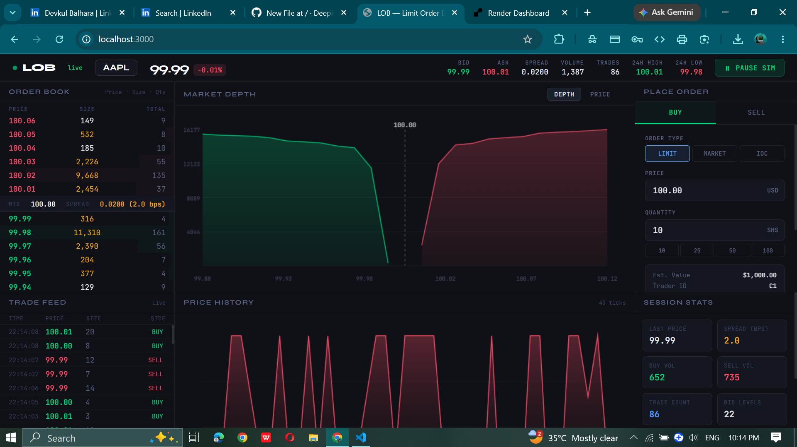

# Limit Order Book — Node.js + WebSocket Backend

### 📊 Trading Dashboard UI


A genuine **client–server** trading system. The matching engine runs entirely on
a Node.js server; any number of browser clients connect over WebSocket and see
the *same* live order book, *same* trades, *same* prices — exactly like a real
exchange gateway.

This is the backend-equivalent rewrite of the original front-end-only demo.
Nothing here runs "in the browser" except rendering — every order, match, and
trade happens on the server.

---

## Architecture

```
┌─────────────┐        WebSocket         ┌──────────────────────┐
│  Browser A  │ ◄──────────────────────► │                      │
└─────────────┘                          │     Node.js Server   │
┌─────────────┐        WebSocket         │  ┌────────────────┐  │
│  Browser B  │ ◄──────────────────────► │  │  OrderBook.js  │  │
└─────────────┘                          │  │ (matching engine)│ │
┌─────────────┐        WebSocket         │  └────────────────┘  │
│  Browser C  │ ◄──────────────────────► │  ┌────────────────┐  │
└─────────────┘                          │  │   Bots.js      │  │
                                          │  │ (MM + Noise)   │  │
                                          │  └────────────────┘  │
                                          └──────────────────────┘
```

- **One shared `OrderBook` instance** lives in server memory. Every connected
  client trades against the exact same book.
- **Bots run server-side**, independent of any browser tab being open — close
  every client and the market keeps moving.
- **Browser is a thin client** — it only renders snapshots and forwards user
  actions (`place_order`, `cancel_order`) to the server.

---

## Files

| File | Role |
|------|------|
| `server.js` | Express + `ws` WebSocket server. Connection handling, message routing, broadcast loop. |
| `src/OrderBook.js` | The matching engine — Price-Time Priority (FIFO), order types, depth/snapshot generation. Framework-agnostic, no Express/ws imports. |
| `src/Bots.js` | `MarketMaker` (two-sided quoting with inventory skew) and `NoiseTrader` (random order flow), both run as background timers on the server. |
| `public/index.html` | The trading terminal UI. Pure client — opens a WebSocket, renders state, sends actions. No matching logic here at all. |

---

## WebSocket Protocol

**Client → Server**
```json
{ "type": "place_order", "side": "buy", "orderType": "limit", "price": 100.25, "quantity": 50 }
{ "type": "cancel_order", "orderId": "O123" }
{ "type": "get_my_orders" }
{ "type": "toggle_sim" }
```

**Server → Client**
```json
{ "type": "welcome", "data": { "clientId": "C1", "traderName": "You-C1", "simRunning": true } }
{ "type": "snapshot", "data": { "bestBid": 99.98, "bestAsk": 100.02, "depth": {...}, "trades": [...] } }
{ "type": "order_ack", "data": { "order": {...}, "trades": [...] } }
{ "type": "cancel_ack", "data": { "ok": true } }
{ "type": "my_orders", "data": [...] }
```

`snapshot` is **broadcast** to every connected client whenever the book
changes (your order, someone else's order, or a bot trade). `order_ack` /
`cancel_ack` / `my_orders` go **only** to the client that asked.

---

## How to Run Locally

```bash
npm install
npm start
```

Then open **http://localhost:3000** in your browser. Open it in two tabs (or
two different machines on the same network) to see both clients trading
against the same live book in real time.

Server logs each connect/disconnect:
```
LOB backend listening on port 3000
WebSocket endpoint shares the same port (same HTTP server)
[connect] C1 (1 clients online)
[connect] C2 (2 clients online)
```

---

## Deploying to Render

This repo includes a `render.yaml` so Render can auto-configure the service.

1. Push the repo to GitHub (`node_modules/` is excluded via `.gitignore` —
   Render runs `npm install` itself during the build).
2. On [render.com](https://render.com): **New + → Web Service** → connect
   your GitHub repo.
3. Render reads `render.yaml` and pre-fills:
   - Build command: `npm install`
   - Start command: `npm start`
4. Click **Create Web Service**. Render assigns a port via `process.env.PORT`,
   which `server.js` already reads — no manual config needed.
5. Once the log shows `LOB backend listening on port <port>`, the service is
   live at the URL Render gives you.

**Note on the free tier:** Render's free instances sleep after 15 minutes of
inactivity and take ~30–50s to wake on the next request. Open the link a
minute before a demo so it's already awake.

The WebSocket client (`public/index.html`) builds its connection URL from
`location.host` and auto-switches to `wss://` on HTTPS, so no client-side
changes are needed between local and deployed environments.

---

## Matching Algorithm (runs on the server, `src/OrderBook.js`)

```
submitOrder(order):
  opposite_book = asks if order.side == BUY else bids
  for price in sorted(opposite_book, by price, best-first):
    if order fully filled: break
    if order.type == LIMIT and price crosses order.price: break
    for resting_order in price_level (FIFO queue):
      fill = min(order.remaining, resting.remaining)
      record_trade(price, fill)
      reduce both orders' remaining by fill
      if resting fully filled: remove from queue
    if level now empty: remove price level
  if order still has remaining qty and type == LIMIT:
    add order to book at its price
  # type == MARKET or IOC: any unfilled remainder is discarded, not queued
```

**Data structures**
| Component | Structure | Why |
|---|---|---|
| Bid/ask book | `Map<price, PriceLevel>` | O(1) level lookup by price |
| Within a level | Array used as FIFO queue | preserves time priority |
| Order lookup (cancel) | `Map<orderId, Order>` | O(1) cancel by id |
| Best bid/ask | `Math.max/min(...keys())` | O(levels), levels ≪ orders |

---

## Server-side Market Participants (`src/Bots.js`)

- **MarketMaker** — quotes both sides around mid price at a fixed spread.
  Tracks its own inventory and skews quotes when it accumulates too much
  long/short exposure, the same risk-management idea real market makers use.
- **NoiseTrader** — places random limit/market orders to keep the book
  active and liquid, simulating retail order flow.

Both run as recursive `setTimeout` loops directly inside the Node process —
they are **not** simulated per-browser, so the market never depends on any
client being connected.

---

## What Changed From the Front-End-Only Version

| | Before | Now |
|---|---|---|
| Matching engine location | Runs in browser JS | Runs on Node.js server |
| State | Local to each browser tab | Single shared instance on server |
| Multi-user | Not possible | Any number of clients see the same book |
| Persistence model | Lost on tab close | Survives as long as the server process runs |
| Client responsibility | Engine + UI | UI only — pure rendering + WS messages |

---

## Suggested Extensions (for a stronger writeup / viva)

- [ ] Persist trade history to SQLite/Postgres on each fill
- [ ] JWT-based auth so `clientId` maps to a real registered user
- [ ] Position & P&L tracking per trader
- [ ] Replace in-memory book with a recovery log (write-ahead log + snapshotting) for crash recovery
- [ ] Add a REST endpoint (`GET /api/depth`, `GET /api/trades`) alongside the WebSocket feed for polling clients
- [ ] Horizontal scaling: move the book into Redis so multiple Node instances can share state behind a load balancer

---

*Inspired by participation in Optiver Trade-A-Thon, Kyoto 2025.*
